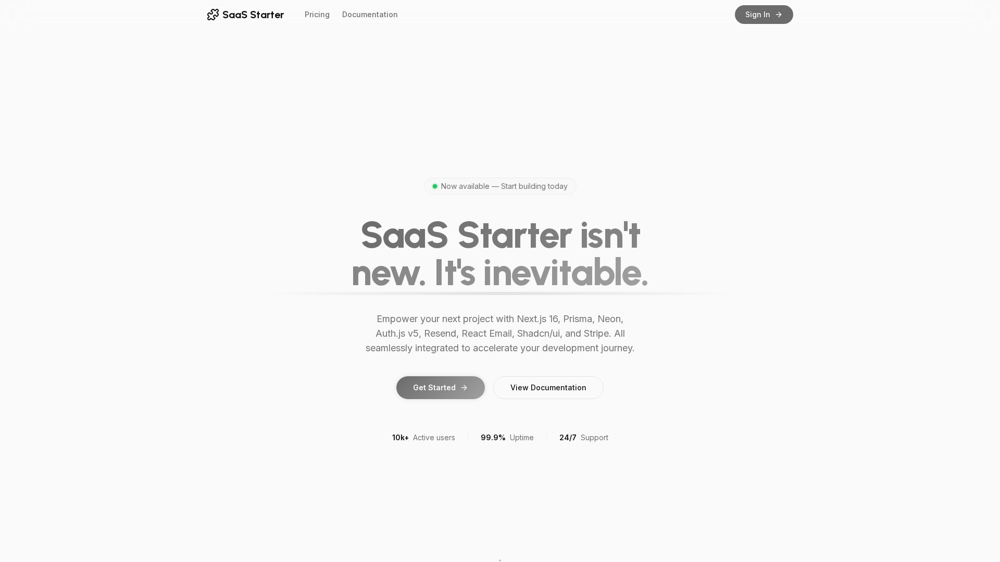

<a href="https://saas-starter-teal-eight.vercel.app/">
  
  <h1 align="center">Next SaaS Stripe Starter</h1>
</a>

<p align="center">
Start now.
</p>

<p align="center">
  <a href="https://github.com/veD-tnayrB/saas-starter">
    
  </a>
  <a href="https://twitter.com/miickasmt">
    
  </a>
</p>

<p align="center">
  <a href="#introduction"><strong>Introduction</strong></a> ·
  <a href="#installation"><strong>Installation</strong></a> ·
  <a href="#features"><strong>Features</strong></a> ·
  <a href="#tech-stack--features"><strong>Tech Stack</strong></a> ·
  <a href="#architecture"><strong>Architecture</strong></a> ·
  <a href="#author"><strong>Author</strong></a> ·
  <a href="#credits"><strong>Credits</strong></a>
</p>
<br/>

## Introduction

Empower your next project with the stack of Next.js 16, Kysely, raw SQL, Neon, Auth.js v5, Resend, React Email, Shadcn/ui, and Stripe.
<br/>
All seamlessly integrated to accelerate your development and saas journey.

**This is an enhanced fork** of [mickasmt/next-saas-stripe-starter](https://github.com/mickasmt/next-saas-stripe-starter) with additional features including multi-project support, project invitations, and a clean architecture pattern.

## Installation

Clone & create this repo locally with the following command:

```bash
npx create-next-app my-saas-project --example "https://github.com/veD-tnayrB/saas-starter"
```

<!-- Or, deploy with Vercel:

[](https://vercel.com/new/clone?repository-url=https%3A%2F%2Fgithub.com%2Fmickasmt%2Fnext-saas-stripe-starter) -->

### Steps

1. Install dependencies using pnpm:

```sh
pnpm install
```

2. Copy `.env.example` to `.env.local` and update the variables.

```sh
cp .env.example .env.local
```

3. Start the development server:

```sh
pnpm run dev
```

> [!NOTE]  
> I use [npm-check-updates](https://www.npmjs.com/package/npm-check-updates) package for update this project.
>
> Use this command for update your project: `ncu -i --format group`

## Features

### 🚀 Core Features

- **Multi-Project Support** – Users can belong to multiple projects with different roles per project
- **Project Invitations** – Beautiful email invitations with secure token-based acceptance
- **Unified Role System** – Project-specific roles (OWNER, ADMIN, MEMBER) with permission-based access
- **Clean Architecture** – Repository/Service pattern for maintainable and scalable code
- **Auto Project Creation** – Personal project automatically created for new users
- **Project CRUD** – Full Create, Read, Update, Delete operations for projects
- **Member Management** – Add, update, and remove project members with role-based permissions

### 🔐 Authentication & Authorization

- **Auth.js v5** – Modern authentication with OAuth providers (Google, GitHub, etc.)
- **Session Management** – Secure JWT-based sessions
- **Platform Admin** – Users who own or admin any project have platform-wide admin access
- **Role-Based Access Control** – Permissions based on project membership roles

### 💳 Payment & Subscriptions

- **Stripe Integration** – Full subscription management
- **Customer Portal** – Self-service billing management
- **Subscription Plans** – Flexible pricing tiers

### 📧 Email System

- **React Email** – Beautiful, responsive email templates
- **Resend** – Reliable email delivery
- **Project Invitations** – Branded invitation emails with Soft Black & Silver theme

### 🎨 UI/UX

- **Soft Black & Silver Theme** – Modern, premium design system
- **Light/Dark Mode** – Full theme support with smooth transitions
- **Framer Motion** – Smooth animations and transitions
- **Responsive Design** – Mobile-first, fully responsive components
- **Shadcn/ui** – Accessible, customizable component library

## Architecture

This project follows a **clean architecture pattern** with clear separation of concerns:

```
├── repositories/     # Data access layer (Kysely queries & raw SQL)
│   ├── auth/        # User authentication repositories
│   └── projects/    # Project, member, and invitation repositories
├── services/         # Business logic layer
│   ├── auth/        # Authentication services
│   ├── projects/    # Project management services
│   └── subscriptions/ # Subscription services
├── clients/          # External API clients
│   ├── auth/        # Auth providers (OAuth, email)
│   ├── email/       # Email service (Resend)
│   └── stripe/      # Stripe integration
├── actions/          # Next.js Server Actions
├── app/              # Next.js App Router
│   ├── api/         # API routes
│   └── (protected)/ # Protected routes
└── components/       # React components
```

### Key Architectural Decisions

- **Repository Pattern**: All database queries isolated in repositories
- **Service Layer**: Business logic separated from data access
- **Project-Specific Roles**: No global user roles; roles are defined per project
- **Atomic Operations**: Project creation and member management use Kysely transactions with raw SQL support
- **Type Safety**: Full TypeScript coverage with strict typing

## Roadmap

- [x] Add resend for success subscriptions
- [ ] Upgrade eslint to v9
- [ ] Project templates and presets
- [ ] Real-time collaboration features
- [ ] Advanced project analytics

## Tech Stack + Features

https://github.com/veD-tnayrB/saas-starter/assets/62285783/828a4e0f-30e3-4cfe-96ff-4dfd9cd55124

### Frameworks

- [Next.js](https://nextjs.org/) – React framework for building performant apps with the best developer experience
- [Auth.js](https://authjs.dev/) – Handle user authentication with ease with providers like Google, Twitter, GitHub, etc.
- [Kysely](https://kysely.dev/) – Type-safe SQL query builder for Node.js with first-class raw SQL support
- [React Email](https://react.email/) – Versatile email framework for efficient and flexible email development

### Platforms

- [Vercel](https://vercel.com/) – Easily preview & deploy changes with git
- [Resend](https://resend.com/) – A powerful email framework for streamlined email development
- [Neon](https://neon.tech/) – Serverless Postgres with autoscaling, branching, bottomless storage and generous free tier.

### UI

- [Tailwind CSS](https://tailwindcss.com/) – Utility-first CSS framework for rapid UI development
- [Shadcn/ui](https://ui.shadcn.com/) – Re-usable components built using Radix UI and Tailwind CSS
- [Framer Motion](https://framer.com/motion) – Motion library for React to animate components with ease
- [Lucide](https://lucide.dev/) – Beautifully simple, pixel-perfect icons
- [`next/font`](https://nextjs.org/docs/basic-features/font-optimization) – Optimize custom fonts and remove external network requests for improved performance
- [`ImageResponse`](https://nextjs.org/docs/app/api-reference/functions/image-response) – Generate dynamic Open Graph images at the edge

### Code Quality

- [TypeScript](https://www.typescriptlang.org/) – Static type checker for end-to-end typesafety
- [Prettier](https://prettier.io/) – Opinionated code formatter for consistent code style
- [ESLint](https://eslint.org/) – Pluggable linter for Next.js and TypeScript

### Miscellaneous

- [Vercel Analytics](https://vercel.com/analytics) – Track unique visitors, pageviews, and more in a privacy-friendly way

## Multi-Project Setup

### Database Schema

The project uses a multi-project architecture with the following models:

- **Project** – Represents a project with an owner and members
- **ProjectMember** – Links users to projects with roles (OWNER, ADMIN, MEMBER)
- **ProjectInvitation** – Manages email invitations with secure tokens

### Creating Projects

When a user registers, a personal project is automatically created:

```typescript
// Automatically happens on user registration
const project = await projectService.createPersonalProject(userId, userName);
```

### Inviting Members

Projects owners and admins can invite members via email:

```typescript
// API endpoint: POST /api/projects/invite
{
  "projectId": "project-id",
  "email": "member@example.com",
  "role": "ADMIN" // or "MEMBER"
}
```

### Project Roles

- **OWNER** – Full control, can delete project and manage all members
- **ADMIN** – Can manage members and project settings (except deletion)
- **MEMBER** – Standard access to project resources

### API Routes

- `GET /api/projects` – List user's projects
- `POST /api/projects` – Create new project
- `GET /api/projects/:id` – Get project details
- `PUT /api/projects/:id` – Update project and members
- `DELETE /api/projects/:id` – Delete project (OWNER only)
- `POST /api/projects/invite` – Send invitation
- `GET /api/projects/accept?token=...` – Accept invitation

## Author

Original project created by [@miickasmt](https://twitter.com/miickasmt) in 2023, released under the [MIT license](https://github.com/shadcn/taxonomy/blob/main/LICENSE.md).

This fork is maintained by [@veD-tnayrB](https://github.com/veD-tnayrB)

## Credits

This project was inspired by shadcn's [Taxonomy](https://github.com/shadcn-ui/taxonomy), Steven Tey's [Precedent](https://github.com/steven-tey/precedent), and Antonio Erdeljac's [Next 13 AI SaaS](https://github.com/AntonioErdeljac/next13-ai-saas).

- Shadcn ([@shadcn](https://twitter.com/shadcn))
- Steven Tey ([@steventey](https://twitter.com/steventey))
- Antonio Erdeljac ([@YTCodeAntonio](https://twitter.com/AntonioErdeljac))
- Original author: Mickasmt ([@miickasmt](https://twitter.com/miickasmt))
