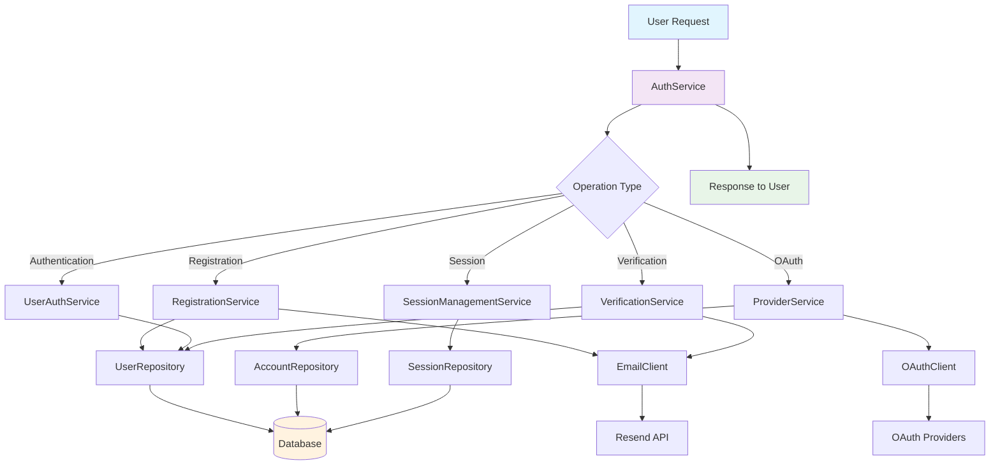

## Overview

The Auth Service is the central orchestrator for all authentication operations in the SaaS Starter Kit. It provides a clean, layered architecture that handles user authentication, session management, email verification, OAuth provider integration, and user profile management.

This service follows clean architecture principles with clear separation between business logic (services), data access (repositories), external integrations (clients), and type definitions. It solves the problem of complex authentication flows by providing a unified interface for all auth-related operations.

**Main Libraries/Services:**

- **NextAuth.js** - Core authentication framework
- **Prisma** - Database ORM for user and session data
- **Resend** - Email service for verification and notifications
- **OAuth Providers** - Google, GitHub, etc. for social login
- **JWT** - Token-based session management
- **Crypto** - Secure token generation

## File Map

**Core Service Layer:**

- `services/auth/index.ts` – Main AuthService orchestrator class
- `services/auth/session.ts` – Session management and JWT handling
- `services/auth/user.ts` – User operations and profile management
- `services/auth/registration.ts` – User registration flow
- `services/auth/verification.ts` – Email verification and password reset
- `services/auth/providers.ts` – OAuth provider integration

**Data Access Layer:**

- `repositories/auth/index.ts` – Repository exports and coordination
- `repositories/auth/user.ts` – User database operations
- `repositories/auth/session.ts` – Session database operations
- `repositories/auth/account.ts` – OAuth account linking

**External Integration Layer:**

- `clients/auth/index.ts` – Client exports and coordination
- `clients/auth/email.ts` – Email service integration
- `clients/auth/oauth.ts` – OAuth provider clients
- `clients/auth/resend.ts` – Resend email service

**Type Definitions:**

- `types/auth/index.ts` – Main type exports
- `types/auth/user.ts` – User-related types
- `types/auth/session.ts` – Session-related types
- `types/auth/provider.ts` – OAuth provider types
- `types/auth/errors.ts` – Error handling types

**Integration Points:**

- `auth.ts` – NextAuth configuration and callbacks
- `auth.config.ts` – Provider configuration
- `middleware.ts` – Route protection and session validation

## Step-by-Step Flow

### 1. User Registration Flow

**Entry Point:** `AuthService.signUpWithEmail()`

1. **Data Validation** (`RegistrationService.initiateRegistration()`)

   - Validate email format and required fields
   - Check for existing user with same email
   - Validate password strength (if applicable)

2. **User Creation** (`UserAuthService.registerUser()`)

   - Create user record in database via `UserRepository`
   - Set default role and verification status
   - Generate user ID and timestamps

3. **Email Verification** (`VerificationService.sendVerificationEmail()`)

   - Generate secure verification token
   - Store token with expiration time
   - Send verification email via `EmailClient`

4. **Response**
   - Return success status with user data
   - Include verification requirement flag

### 2. User Authentication Flow

**Entry Point:** `AuthService.signInWithEmail()`

1. **Credential Validation** (`UserAuthService.authenticateUser()`)

   - Look up user by email in database
   - Validate user exists and is active
   - Check email verification status

2. **Session Creation** (`SessionManagementService.createUserSession()`)

   - Generate secure session token
   - Create session record in database
   - Set session expiration (30 days default)

3. **JWT Token Generation** (`JWTService.createJWTToken()`)

   - Create JWT with user data and expiration
   - Sign token with secret key
   - Return token for client storage

4. **Response**
   - Return success with user data and session info
   - Include any verification requirements

### 3. OAuth Provider Flow

**Entry Point:** `AuthService.signInWithProvider()`

1. **OAuth Callback Handling** (`ProviderService.handleOAuthCallback()`)

   - Exchange authorization code for access token
   - Fetch user profile from OAuth provider
   - Validate provider response

2. **Account Linking** (`AccountRepository.findAccountByProvider()`)

   - Check if OAuth account already linked
   - Create new account link if needed
   - Associate with existing user or create new user

3. **User Creation/Update** (`UserAuthService.registerUser()` or `updateUser()`)

   - Create new user if first-time OAuth login
   - Update existing user profile with OAuth data
   - Set appropriate role and verification status

4. **Session Management** (`SessionManagementService.createUserSession()`)
   - Create session for authenticated user
   - Generate JWT token with user data
   - Return session information

### 4. Session Management Flow

**Entry Point:** `AuthService.getCurrentUser()` or middleware

1. **Session Validation** (`SessionManagementService.validateSession()`)

   - Extract session token from request
   - Validate token signature and expiration
   - Check session exists in database

2. **User Data Retrieval** (`UserRepository.findUserById()`)

   - Fetch current user data from database
   - Include user profile and preferences
   - Check user status and permissions

3. **Role Verification** (`SessionManagementService.hasRole()`)
   - Validate user has required permissions
   - Check role-based access control
   - Return authorization status

### 5. Email Verification Flow

**Entry Point:** `AuthService.verifyEmailToken()`

1. **Token Validation** (`VerificationService.verifyEmailToken()`)

   - Validate token format and signature
   - Check token expiration time
   - Retrieve associated user ID

2. **User Update** (`UserRepository.updateUserVerification()`)

   - Mark email as verified in database
   - Update verification timestamp
   - Remove verification token

3. **Response**
   - Return success with updated user data
   - Include verification status

### 6. Password Reset Flow

**Entry Point:** `AuthService.sendPasswordResetEmail()`

1. **User Lookup** (`UserRepository.findUserByEmail()`)

   - Find user by email address
   - Validate user exists and is active

2. **Reset Token Generation** (`VerificationService.generateResetToken()`)

   - Create secure reset token
   - Set token expiration (1 hour default)
   - Store token in database

3. **Email Sending** (`EmailClient.sendPasswordResetEmail()`)

   - Generate reset email template
   - Include secure reset link
   - Send via email service

4. **Password Update** (`AuthService.resetPassword()`)
   - Validate reset token
   - Hash new password securely
   - Update user password in database
   - Invalidate reset token

## Data Flow Diagram

## Dependencies & Contracts

**Core Types:**

- `AuthUser` - Represents a logged-in user with profile data
- `AuthSession` - Session data with user information and expiration
- `UserRegistrationData` - Input data for user registration
- `UserUpdateData` - Data for updating user profiles
- `SessionValidationResult` - Result of session validation with user data
- `ProviderAuthResult` - OAuth provider authentication result

**Service Interfaces:**

- `SessionManagementService` - Handles session creation, validation, and cleanup
- `UserAuthService` - Manages user authentication and profile operations
- `RegistrationService` - Orchestrates user registration flow
- `VerificationService` - Handles email verification and password reset
- `ProviderManagementService` - Manages OAuth provider integration

**Repository Contracts:**

- `UserRepository` - Database operations for user data
- `SessionRepository` - Database operations for session data
- `AccountRepository` - Database operations for OAuth account linking

**Client Interfaces:**

- `EmailClient` - Email service integration for notifications
- `OAuthClient` - OAuth provider integration for social login

## Known Limitations

1. **Session Storage** - Sessions are stored in database, which may impact performance at scale
2. **Email Verification** - Verification tokens are stored in memory (should be persisted)
3. **OAuth Implementation** - Some OAuth provider methods are marked as TODO
4. **Password Reset** - Reset tokens have 1-hour expiration (configurable)
5. **Rate Limiting** - No built-in rate limiting for auth operations
6. **Multi-Factor Authentication** - Not currently implemented
7. **Session Cleanup** - Expired sessions cleanup is manual (should be automated)

## Notes & TODOs

**High Priority:**

- [ ] Implement persistent verification token storage
- [ ] Add rate limiting for authentication endpoints
- [ ] Complete OAuth provider callback implementations
- [ ] Add automated session cleanup job
- [ ] Implement proper error logging and monitoring

**Medium Priority:**

- [ ] Add multi-factor authentication support
- [ ] Implement session refresh mechanism
- [ ] Add user activity tracking
- [ ] Create admin user management interface
- [ ] Add password strength validation

**Low Priority:**

- [ ] Add social login providers (GitHub, LinkedIn)
- [ ] Implement account linking UI
- [ ] Add user preference management
- [ ] Create user analytics dashboard
- [ ] Add API key authentication for services

**Technical Debt:**

- [ ] Replace `any` types with proper TypeScript interfaces
- [ ] Add comprehensive unit tests for all services
- [ ] Implement proper error handling with custom error types
- [ ] Add request/response logging for debugging
- [ ] Create service health check endpoints
