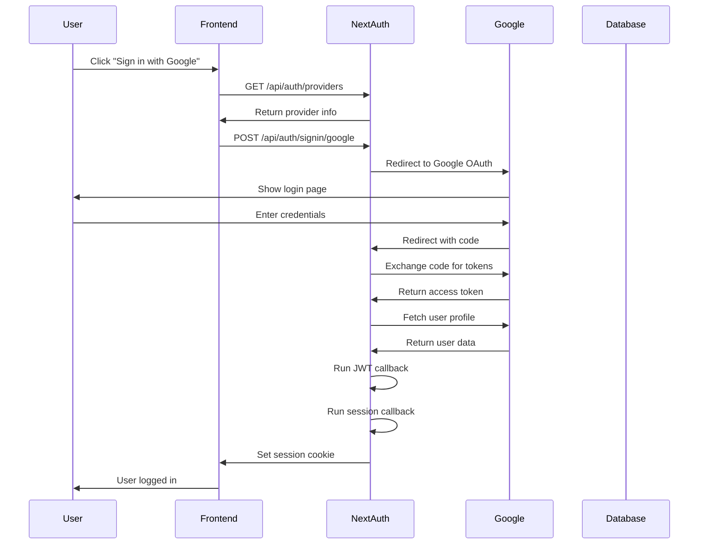

## 🎯 What This Guide Covers

This guide explains **exactly** how authentication works in our SaaS app. By the end, you'll understand:

- How OAuth flows work (Google, GitHub, etc.)
- What NextAuth.js does behind the scenes
- How sessions are created and managed
- How to debug authentication issues
- The actual HTTP requests and responses

## 🏗️ Arquitectura Simplificada para SaaS Starter Kit

Nuestra arquitectura de autenticación está diseñada para ser **rápida de desarrollar** y **fácil de entender**. Usamos instanciación directa con ES6 imports para mantener la simplicidad y consistencia.

```
┌─────────────────┐    ┌─────────────────┐    ┌─────────────────┐
│   Frontend      │    │   NextAuth.js   │    │   OAuth Provider │
│   (React)       │◄──►│   (Server)      │◄──►│   (Google, etc.) │
└─────────────────┘    └─────────────────┘    └─────────────────┘
         │                       │                       │
         │                       │                       │
         ▼                       ▼                       ▼
┌─────────────────┐    ┌─────────────────┐    ┌─────────────────┐
│   Session       │    │   Database      │    │   User Profile  │
│   (JWT/Cookie)  │    │   (Kysely + SQL)│    │   (Provider)    │
└─────────────────┘    └─────────────────┘    └─────────────────┘
```

### 📁 Estructura Simplificada

**Servicios (Lógica de Negocio):**

- `services/auth/` - Autenticación y gestión de usuarios
- `services/billing/` - Facturación y suscripciones
- `services/notifications/` - Emails y notificaciones

**Repositorios (Base de Datos):**

- `repositories/auth/` - Operaciones de base de datos

**Clientes (APIs Externas):**

- `clients/auth/` - Integraciones con servicios externos

**Acciones (Server Actions):**

- `actions/` - Funciones del servidor que usan servicios

## 📁 Key Files Explained

**Configuration Files:**

- `auth.ts` - Main NextAuth configuration (providers, callbacks, session strategy)
- `config/auth.ts` - OAuth provider settings (Google, GitHub, etc.)
- `app/api/auth/[...nextauth]/route.ts` - API route that handles all auth requests

**Service Files:**

- `services/auth/session.ts` - Custom session management logic
- `services/auth/user.ts` - User operations (create, update, delete)
- `repositories/auth/` - Database operations for users and sessions

**Type Files:**

- `types/auth/` - TypeScript interfaces for users, sessions, and providers

## 🔐 OAuth Flow Explained (Step by Step)

### What is OAuth?

OAuth is like a "valet key" for your account. Instead of giving your password to every app, you give permission for the app to access specific parts of your account.

### Google OAuth Flow (Detailed)

Let's trace through **exactly** what happens when a user clicks "Sign in with Google":

#### Step 1: User Clicks "Sign in with Google"

**What happens:**

- User clicks button in your React component
- Frontend makes a request to `/api/auth/providers`
- NextAuth returns available providers

**HTTP Request:**

```http
GET /api/auth/providers
```

**Response:**

```json
{
  "google": {
    "id": "google",
    "name": "Google",
    "type": "oidc",
    "signinUrl": "http://localhost:3000/api/auth/signin/google",
    "callbackUrl": "http://localhost:3000/api/auth/callback/google"
  }
}
```

#### Step 2: NextAuth Generates OAuth URL

**What happens:**

- NextAuth creates a secure OAuth URL with:
  - Your app's client ID
  - A random state parameter (prevents CSRF attacks)
  - A code challenge (PKCE security)
  - Redirect URL back to your app

**Generated URL Example:**

```
https://accounts.google.com/o/oauth2/v2/auth?
  response_type=code&
  client_id=286317980099-59u5kdc0dor232moch9bufgusqp90igl.apps.googleusercontent.com&
  redirect_uri=http%3A%2F%2Flocalhost%3A3000%2Fapi%2Fauth%2Fcallback%2Fgoogle&
  code_challenge=4mD3JVl4lXZ7Uw0jCNp-cz0lx1exRRE2RtBEX7WSaTA&
  code_challenge_method=S256&
  scope=openid+profile+email&
  state=random-state-string
```

#### Step 3: User Authorizes on Google

**What happens:**

- User is redirected to Google's login page
- User enters their Google credentials
- Google shows permission screen: "App wants to access your profile"
- User clicks "Allow"

#### Step 4: Google Redirects Back with Code

**What happens:**

- Google redirects back to your app with an authorization code
- The code is temporary and can only be used once

**Redirect URL:**

```
http://localhost:3000/api/auth/callback/google?
  code=4/0AX4XfWh...&
  state=random-state-string
```

#### Step 5: NextAuth Exchanges Code for Tokens

**What happens:**

- NextAuth makes a POST request to Google's token endpoint
- Exchanges the authorization code for access tokens

**HTTP Request to Google:**

```http
POST https://oauth2.googleapis.com/token
Content-Type: application/x-www-form-urlencoded

code=4/0AX4XfWh...&
client_id=your-client-id&
client_secret=your-client-secret&
redirect_uri=http://localhost:3000/api/auth/callback/google&
grant_type=authorization_code&
code_verifier=code-verifier-string
```

**Google's Response:**

```json
{
  "access_token": "ya29.a0AfH6SMC...",
  "expires_in": 3599,
  "refresh_token": "1//04...",
  "scope": "openid profile email",
  "token_type": "Bearer",
  "id_token": "eyJhbGciOiJSUzI1NiIs..."
}
```

#### Step 6: NextAuth Fetches User Profile

**What happens:**

- NextAuth uses the access token to fetch user profile from Google
- Gets user's name, email, profile picture, etc.

**HTTP Request to Google:**

```http
GET https://www.googleapis.com/oauth2/v2/userinfo
Authorization: Bearer ya29.a0AfH6SMC...
```

**Google's Response:**

```json
{
  "id": "123456789",
  "email": "user@gmail.com",
  "verified_email": true,
  "name": "John Doe",
  "given_name": "John",
  "family_name": "Doe",
  "picture": "https://lh3.googleusercontent.com/...",
  "locale": "en"
}
```

#### Step 7: Your JWT Callback Runs

**What happens:**

- NextAuth calls your `jwt` callback function
- You can modify the token before it's stored
- This is where you add custom user data

**Your JWT Callback Code:**

```typescript
// In auth.ts
callbacks: {
  async jwt({ token, user, account, profile }) {
    // This runs when user signs in
    if (user) {
      token.id = user.id;
      token.email = user.email;
      token.name = user.name;
      token.picture = user.picture;
      token.role = user.role || 'USER';
    }
    return token;
  }
}
```

#### Step 8: Your Session Callback Runs

**What happens:**

- NextAuth calls your `session` callback function
- You return the final session data that will be available in your app

**Your Session Callback Code:**

```typescript
// In auth.ts
callbacks: {
  async session({ token, session }) {
    // This runs every time session is accessed
    session.user.id = token.id;
    session.user.email = token.email;
    session.user.name = token.name;
    session.user.picture = token.picture;
    session.user.role = token.role;
    return session;
  }
}
```

#### Step 9: Session is Stored

**What happens:**

- NextAuth stores the session in a secure HTTP-only cookie
- Cookie contains the JWT token with user data
- User is now logged in

**Cookie Example:**

```
next-auth.session-token=eyJhbGciOiJIUzI1NiIsInR5cCI6IkpXVCJ9...
```

## 🔄 Session Management Flow

### How Sessions Work

Sessions are how your app knows who is logged in. Here's how they work:

#### 1. Session Creation

- Created when user successfully authenticates
- Stored as JWT token in HTTP-only cookie
- Contains user ID, email, role, and expiration time

#### 2. Session Validation

- Every request checks the session cookie
- Validates JWT signature and expiration
- Extracts user data from token

#### 3. Session Usage

- Available in server components via `getServerSession()`
- Available in client components via `useSession()`
- Used for authorization and user-specific data

### Session Flow Diagram



## 🐛 Debugging Authentication Issues

### Common Problems and Solutions

#### 1. "Invalid redirect URI" Error

**Problem:** Google rejects the redirect URI
**Solution:** Check your Google Console settings

- Go to Google Cloud Console
- Navigate to APIs & Services > Credentials
- Add `http://localhost:3000/api/auth/callback/google` to authorized redirect URIs

#### 2. "State parameter mismatch" Error

**Problem:** CSRF protection fails
**Solution:** Check your AUTH_SECRET environment variable

```bash
# Generate a new secret
openssl rand -base64 32
```

#### 3. "User not found" Error

**Problem:** User exists in Google but not in your database
**Solution:** Check your JWT callback

- Make sure you're creating users in the database
- Check if the Kysely adapter is properly configured

#### 4. Session is null

**Problem:** Session not being created or retrieved
**Solution:** Check session strategy

```typescript
// In auth.ts
session: {
  strategy: "jwt";
} // or "database"
```

### Debug Tools

#### 1. Enable NextAuth Debug Mode

```typescript
// In auth.ts
const nextAuthConfig = {
  // ... other config
  debug: process.env.NODE_ENV !== "production",
};
```

#### 2. Add Logging to Callbacks

```typescript
// In auth.ts
callbacks: {
  async jwt({ token, user, account, profile }) {
    console.log('🔐 JWT Callback:', { token, user, account, profile });
    // ... your logic
  },
  async session({ token, session }) {
    console.log('📝 Session Callback:', { token, session });
    // ... your logic
  },
}
```

#### 3. Check Network Tab

- Open browser DevTools
- Go to Network tab
- Look for requests to `/api/auth/*`
- Check request/response data

## 🔧 Adding New OAuth Providers

### Step 1: Configure Provider

Add provider to `config/auth.ts`:

```typescript
// For GitHub
GitHub({
  clientId: env.GITHUB_CLIENT_ID,
  clientSecret: env.GITHUB_CLIENT_SECRET,
});

// For Discord
Discord({
  clientId: env.DISCORD_CLIENT_ID,
  clientSecret: env.DISCORD_CLIENT_SECRET,
});
```

### Step 2: Set Up Provider App

1. Go to provider's developer console
2. Create new OAuth application
3. Set redirect URI to `http://localhost:3000/api/auth/callback/[provider]`
4. Copy client ID and secret to environment variables

### Step 3: Test the Flow

1. Start your app: `pnpm dev`
2. Go to login page
3. Click the new provider button
4. Complete OAuth flow
5. Check if user is created in database

## 📊 Database Schema

### Users Table

```sql
CREATE TABLE "User" (
  "id" TEXT NOT NULL,
  "name" TEXT,
  "email" TEXT NOT NULL,
  "emailVerified" TIMESTAMP(3),
  "image" TEXT,
  "role" "UserRole" NOT NULL DEFAULT 'USER',
  "createdAt" TIMESTAMP(3) NOT NULL DEFAULT CURRENT_TIMESTAMP,
  "updatedAt" TIMESTAMP(3) NOT NULL,
  CONSTRAINT "User_pkey" PRIMARY KEY ("id")
);
```

### Accounts Table (OAuth)

```sql
CREATE TABLE "Account" (
  "id" TEXT NOT NULL,
  "userId" TEXT NOT NULL,
  "type" TEXT NOT NULL,
  "provider" TEXT NOT NULL,
  "providerAccountId" TEXT NOT NULL,
  "refresh_token" TEXT,
  "access_token" TEXT,
  "expires_at" INTEGER,
  "token_type" TEXT,
  "scope" TEXT,
  "id_token" TEXT,
  "session_state" TEXT,
  CONSTRAINT "Account_pkey" PRIMARY KEY ("id")
);
```

### Sessions Table

```sql
CREATE TABLE "Session" (
  "id" TEXT NOT NULL,
  "sessionToken" TEXT NOT NULL,
  "userId" TEXT NOT NULL,
  "expires" TIMESTAMP(3) NOT NULL,
  CONSTRAINT "Session_pkey" PRIMARY KEY ("id")
);
```

## 🚀 Production Considerations

### Security Checklist

- [ ] Use HTTPS in production
- [ ] Set secure cookie flags
- [ ] Use strong AUTH_SECRET
- [ ] Enable CSRF protection
- [ ] Validate all inputs
- [ ] Use rate limiting
- [ ] Monitor failed login attempts

### Performance Tips

- [ ] Use JWT strategy for better performance
- [ ] Implement session cleanup
- [ ] Use Redis for session storage (if needed)
- [ ] Cache user data appropriately
- [ ] Monitor authentication metrics

## 📚 Additional Resources

- [NextAuth.js Documentation](https://next-auth.js.org/)
- [OAuth 2.0 Specification](https://tools.ietf.org/html/rfc6749)
- [JWT.io](https://jwt.io/) - JWT token decoder
- [Google OAuth 2.0 Guide](https://developers.google.com/identity/protocols/oauth2)

## ❓ FAQ

**Q: Why do we use NextAuth instead of implementing OAuth manually?**
A: NextAuth handles security, CSRF protection, session management, and provider integration. Implementing this manually would be error-prone and time-consuming.

**Q: Can I customize the OAuth flow?**
A: Yes! You can customize callbacks, add custom providers, and modify session data.

**Q: How do I handle user roles and permissions?**
A: Add role data in your JWT callback and check it in your session callback.

**Q: What if I need to store additional user data?**
A: Add the necessary columns via SQL migrations and update your Kysely repositories plus NextAuth callbacks to include the new data.

**Q: How do I debug authentication issues?**
A: Enable debug mode, add logging to callbacks, and check the Network tab in DevTools.

---

_This guide should give you a complete understanding of how authentication works in our app. If you have questions, check the debugging section or ask a senior developer!_
