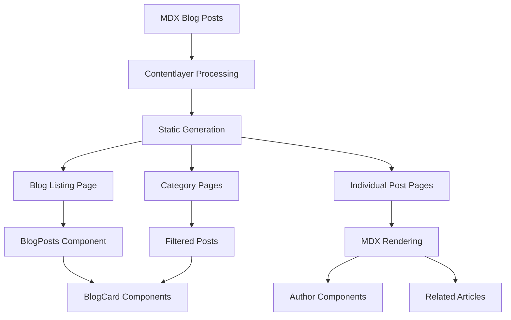

# Blog Flow

## Overview

Manages blog content creation, organization, and rendering using Contentlayer and MDX. Provides a complete blog system with categories, authors, and related articles functionality. The blog serves as a content marketing platform for the SaaS application.

**Main Libraries/Services:**

- `contentlayer2` - Content management and static generation
- `MDX` - Markdown with JSX components for rich content
- `@tailwindcss/typography` - Typography styling for blog content
- `rehype` and `remark` plugins for content processing

## File Map

```
📁 config/blog.ts - Blog configuration (categories, authors)
📁 contentlayer.config.ts - Contentlayer configuration for blog posts
📁 content/blog/ - MDX blog post files
📁 app/(marketing)/blog/page.tsx - Main blog listing page
📁 app/(marketing)/blog/category/[slug]/page.tsx - Category filtered posts
📁 app/(marketing)/(blog-post)/blog/[slug]/page.tsx - Individual blog post page
📁 app/(marketing)/blog/layout.tsx - Blog layout wrapper
📁 components/content/blog-posts.tsx - Blog posts grid component
📁 components/content/blog-card.tsx - Individual blog post card
📁 components/content/blog-header-layout.tsx - Blog header with navigation
📁 components/content/author.tsx - Author display component
📁 components/content/mdx-components.tsx - MDX component mapping
```

## Step-by-Step Flow

### Blog Post Creation

1. Create new MDX file in `content/blog/` directory
2. Add frontmatter with required fields:
   - `title`: Post title
   - `description`: Post description
   - `image`: Featured image path
   - `date`: Publication date
   - `authors`: Array of author usernames
   - `categories`: Array of category slugs
   - `related`: Optional related post slugs
3. Write content using MDX syntax with custom components
4. Contentlayer processes the file during build
5. Static routes are generated for the new blog post

### Blog Listing Page

1. User navigates to `/blog`
2. `app/(marketing)/blog/page.tsx` loads all published posts
3. Posts are filtered by `published: true`
4. Posts are sorted by date (newest first)
5. Blur data URLs are generated for all post images
6. `BlogPosts` component renders the grid layout
7. First post displays horizontally, others in grid

### Category Filtering

1. User clicks category link in blog header
2. Navigates to `/blog/category/[slug]`
3. `app/(marketing)/blog/category/[slug]/page.tsx` receives category slug
4. Posts are filtered by matching category
5. Category information is displayed in header
6. Filtered posts are rendered in grid layout

### Individual Blog Post

1. User clicks on blog post card
2. Navigates to `/blog/[slug]`
3. `app/(marketing)/(blog-post)/blog/[slug]/page.tsx` finds post by slug
4. Post metadata is generated for SEO
5. Table of contents is extracted from content
6. Related articles are found and displayed
7. MDX content is rendered with custom components
8. Author information and social links are displayed

### Content Processing Pipeline

1. Contentlayer scans `content/blog/` for MDX files
2. Files are processed as `Post` document type
3. Frontmatter is validated against schema
4. MDX content is transformed with plugins:
   - `remarkGfm` for GitHub Flavored Markdown
   - `rehypeSlug` for heading IDs
   - `rehypePrettyCode` for syntax highlighting
   - `rehypeAutolinkHeadings` for heading links
5. Static routes are generated for all posts

## Data Flow Diagram



## Dependencies & Contracts

### Blog Configuration

- `BLOG_CATEGORIES`: Array of category objects with title, slug, and description
- `BLOG_AUTHORS`: Object mapping author usernames to author data

### Post Schema

```typescript
{
  title: string (required)
  description?: string
  date: string (required)
  published?: boolean (default: true)
  image: string (required)
  authors: string[] (required)
  categories: ("news" | "education")[] (required)
  related?: string[]
}
```

### Author Schema

```typescript
{
  name: string;
  image: string;
  twitter: string;
}
```

## Known Limitations

- Only two categories supported: "news" and "education"
- Author images must be stored in `/_static/avatars/` directory
- Related articles must reference existing post slugs
- No dynamic category creation - must be defined in config
- No draft/publish workflow - uses `published` frontmatter field

## Notes & TODOs

- ✅ MDX blog posts with rich content support
- ✅ Category filtering and navigation
- ✅ Author management with social links
- ✅ Related articles functionality
- ✅ SEO metadata generation
- ✅ Table of contents for long posts
- ✅ Responsive image handling with blur placeholders
- ⚠️ Limited to two predefined categories
- 🔄 Add more blog categories (tutorials, case studies, etc.)
- 🔄 Implement blog post search functionality
- 🔄 Add blog post tags system
- 🔄 Create blog post series functionality
- 🔄 Add blog post comments system
- 🔄 Implement blog post analytics
- 🔄 Add blog post scheduling for future publication
