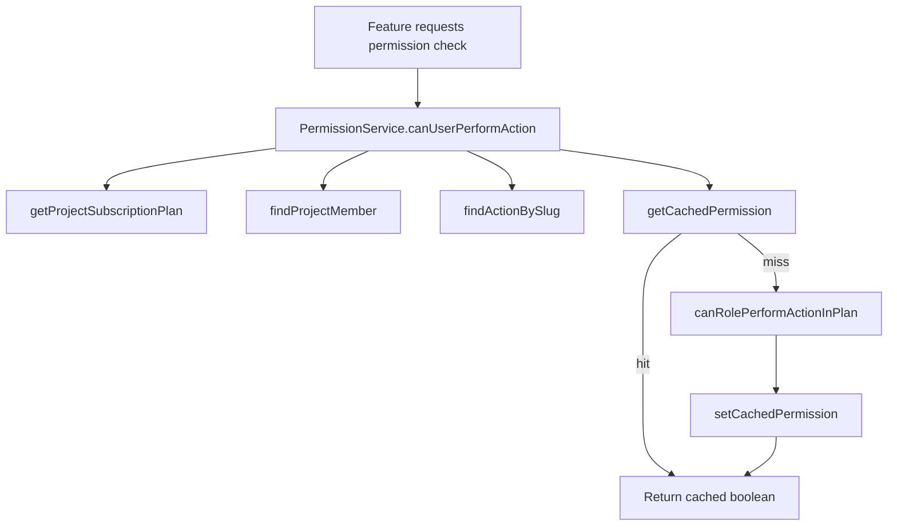

## Overview

The permissions flow determines whether a project member can perform an action based on their role and the project’s subscription plan. `services/permissions` orchestrates cache-aware permission checks, while plan/role/action relationships live in the permissions repositories. Cache helpers ensure repeated checks remain fast, and invalidation hooks are available when permissions change (plan upgrades, role updates, action edits).

**Main Libraries/Services:**

- **services/permissions/permission-service.ts** – Main permission API (`canUserPerformAction`, `canUserPerformActions`); handles caching, plan lookup, role lookup, and action resolution.
- **services/permissions/cache-service.ts** – Exposes cache invalidation helpers (`clearAll`, `clearForPlan`, `clearForRole`, etc.) and retrieves cache stats.
- **repositories/permissions** – Supplies plan/action metadata, performs permission queries, and provides cache get/set/clear utilities.
- **repositories/projects/members** – Returns project membership including role information for the user.
- **services/subscriptions/get-plan.ts** – Retrieves the project’s subscription plan and its plan ID used for permission lookups.
- **services/auth/platform-admin.ts** (indirectly) – Higher-level features rely on permission checks in conjunction with platform admin logic.

## File Map

- `services/permissions/index.ts` – Exports singleton instances (`permissionService`, `cacheService`) for consumers.
- `services/permissions/permission-service.ts` – Implements the core permission logic; caches results using repository helpers.
- `services/permissions/cache-service.ts` – Wrapper around permission cache functions for targeted invalidation.
- `repositories/permissions/actions.ts`, `plans.ts`, `roles.ts`, `permissions.ts` – Provide plan/action metadata, permission rules, and cache functions (`getCachedPermission`, `setCachedPermission`, `getPermissionCacheKey`).
- `repositories/projects/members.ts` – Supplies `findProjectMember` to obtain user roles in a project.
- `services/subscriptions/get-plan.ts` – Provides `getProjectSubscriptionPlan` so permissions can consider the project’s billing tier.
- `app/(protected)/...` (dashboard pages, API routes, server actions) – Import `permissionService` to guard protected operations (inviting members, accessing analytics, etc.).

## Step-by-Step Flow

### Single Permission Check

1. A feature (e.g., member invitation UI, analytics view) calls `permissionService.canUserPerformAction(userId, projectId, actionSlug)`.
2. PermissionService fetches the project’s plan via `getProjectSubscriptionPlan(projectId)`. If no plan exists, it falls back to the Free plan.
3. It retrieves the user’s project membership (`findProjectMember`) to determine their role.
4. The action metadata is loaded through `findActionBySlug(actionSlug)`.
5. A cache key is generated with `getPermissionCacheKey(planId, roleId, actionSlug)`; cached results (if any) are returned immediately.
6. If no cache hit, `canRolePerformActionInPlan(planId, roleId, actionId)` checks the database to confirm the role’s permission under the plan.
7. The result is stored in the cache via `setCachedPermission` and returned to the caller.

### Batch Permission Check

1. Features like menus or dashboards need multiple permission results simultaneously.
2. `permissionService.canUserPerformActions(userId, projectId, actionSlugs[])` iterates each slug and calls `canUserPerformAction`.
3. The method aggregates results into a map (`Record<string, boolean>`) and returns it, benefiting from per-action caching along the way.

### Cache Invalidation

1. When plan permissions are updated (e.g., an admin enables new actions), `cacheService.clearForPlan(planId)` removes stale cache entries for that plan.
2. Role updates (changing permissions for a role) can use `clearForRole(roleId)`.
3. Action edits (renaming/removing features) can trigger `clearForAction(actionSlug)`.
4. System-wide changes call `clearAll()`; `getStats()` aids monitoring.

## Data Flow Diagram

## Dependencies & Contracts

- `canUserPerformAction(userId, projectId, actionSlug)` – Returns a boolean; main entry for single permission checks.
- `canUserPerformActions(userId, projectId, actionSlugs[])` – Returns a map of action slug to boolean.
- Cache helpers (`getPermissionCacheKey`, `getCachedPermission`, `setCachedPermission`, `clear*`) – Manage the in-memory permission cache.
- `findProjectMember(projectId, userId)` – Must return the member with embedded `role`; missing membership denies access.
- `findActionBySlug(slug)` – Action metadata including `id` and descriptive info.
- `canRolePerformActionInPlan(planId, roleId, actionId)` – Database check to see if a role can perform a specific action within a plan.
- `cacheService` – Exposed invalidation API to keep cached permissions accurate after plan/role changes.

## Known Limitations

- Permissions are cached per plan/role/action without automatic invalidation when plans change; manual cache clear is required.
- Fallback to the Free plan when a project has no plan may allow unintended access if plan setup fails.
- Permission checks rely on synchronous Stripe plan lookups; failures in subscription retrieval could impact authorization.
- There is no auditing or logging of permission decisions beyond console errors.

## Notes & TODOs

- Integrate automatic cache invalidation when plan, role, or action records change via repository hooks or events.
- Add structured logging/auditing to trace permission denials for support and debugging.
- Extend permission definitions to handle project-specific overrides or temporary grants.
- Implement unit/integration tests covering caching behavior, fallback logic, and batch checks.
