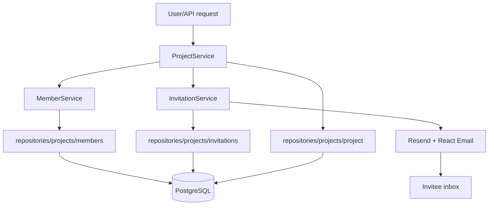

## Overview

The projects flow covers project CRUD, member management, and the invitation lifecycle. `ProjectService` drives project creation and updates, `MemberService` manages membership logic, and `InvitationService` sends and accepts invitations. Repositories encapsulate all SQL via Kysely, while React-email templates deliver invitation emails through Resend.

**Main Libraries/Services:**

- **services/projects/project-service.ts** – Core project logic (create, update, delete, personal projects, enriched project listings).
- **services/projects/member-service.ts** – Member CRUD, role lookups, and helper permission checks.
- **services/projects/invitation-service.ts** – Invitation creation, email delivery, acceptance, and cancellation.
- **repositories/projects/\*** – Kysely-based queries for projects, members, and invitations (including caching for member lookups).
- **emails/project-invitation-email.tsx** – React Email template sent via Resend when inviting collaborators.
- **services/auth/user** / **services/auth/session** – Provide user context for automatic personal projects and invitation validation.

## File Map

- `services/projects/index.ts` – Exposes singletons (`projectService`, `memberService`, `invitationService`).
- `services/projects/project-service.ts` – Implements project lifecycle operations and orchestrates member/invitation services.
- `services/projects/member-service.ts` – Adds/removes members, updates roles, and fetches role assignments.
- `services/projects/invitation-service.ts` – Generates invitations, sends emails, and accepts/cancels invitations.
- `repositories/projects/project.ts` – CRUD operations for projects and enriched queries (e.g., `findAllUserProjects`).
- `repositories/projects/members.ts` – Member CRUD and role lookup helpers used across services.
- `repositories/projects/invitations.ts` – Invitation persistence (create, find, delete) and lookup by token/email.
- `app/api/projects/*` & `app/accept-invitation/page.tsx` – API routes and pages consuming the services above.

## Step-by-Step Flow

### Project Creation & Personal Projects

1. API route or onboarding flow calls `projectService.createProject({ name, ownerId, members? })`.
2. ProjectService loads the OWNER role via permissions repo and executes `createProjectWithOwner`, which atomically creates the project and adds the owner as OWNER member.
3. Optional members array is processed:
   - Existing users → added via `memberService.addMember`.
   - Non-existent users → receive invitations through `invitationService.createInvitation`.
4. `createPersonalProject(userId, userName)` wraps `createProject`, ensures a personal project exists, and double-checks the OWNER role assignment.

### Project Listing & Enrichment

1. Dashboard/API requests `projectService.getUserProjects(userId)`.
2. Service fetches all projects the user owns or belongs to (`findAllUserProjects`) and enriches each project with:
   - The user’s role (`memberService.getUserRole`).
   - Owner information (`findUserById`).
   - Member count (`memberService.getProjectMembers`).
3. The enriched list powers UI elements like project switchers.

### Project Update & Member Management

1. `projectService.updateProject(projectId, data, actorId)` validates permissions via `memberService.getUserRole` and `canUpdateSettings`.
2. Name changes are persisted with `updateProject`.
3. Member operations (`add`, `update`, `remove`) are processed:
   - Add/update with existing users uses `memberService` helpers.
   - New emails trigger invitations through `invitationService`.
   - Removing members cancels pending invitations via `deleteInvitationByToken`.
4. The service returns the updated project plus a summary of member actions performed.

### Project Deletion

1. `projectService.deleteProject(projectId, actorId)` checks the actor is OWNER (`canDeleteProject`) and matches the project ownerId.
2. The project is deleted via `deleteProjectRepository`; database constraints cascade to members and invitations.

### Invitation Lifecycle

1. `invitationService.createInvitation(projectId, email, role, invitedBy)` validates project existence, ensures no duplicate membership or invitation, generates a UUID token, stores it for 7 days, and sends the email via Resend.
2. `invitationService.acceptInvitation(token, userId)` validates token, expiration, and email match; adds the user as member if needed, deletes the invitation, and returns `projectId`.
3. `invitationService.cancelInvitation(token, userId)` ensures the actor has ADMIN-level access and deletes the invitation.

## Data Flow Diagram

## Dependencies & Contracts

- `projectService.createProject(data)` – Creates a project and optionally invites members; returns project plus invited list.
- `projectService.createPersonalProject(userId, userName)` – Ensures every user has a personal project with OWNER role.
- `projectService.getUserProjects(userId)` – Returns enriched projects the user owns or belongs to (includes role, owner info, member count).
- `projectService.updateProject(id, data, actorId)` – Updates project name and processes member add/update/remove actions.
- `projectService.deleteProject(id, actorId)` – Deletes a project after OWNER verification.
- `memberService` – `getUserRole`, `addMember`, `updateMemberRole`, `removeMember`, `isProjectMember`.
- `invitationService` – `createInvitation`, `acceptInvitation`, `cancelInvitation`, `getProjectInvitations`.
- Invitation tokens – UUID stored with expiration; acceptance requires exact email match.

## Known Limitations

- Invitation expiration is fixed (7 days); there is no extend/resend flow yet.
- No project ownership transfer; deleting the owner removes the project entirely.
- Member operations are processed sequentially and lack transactional rollbacks per member.
- Personal project naming defaults to “My Project” when user name is missing.
- `memberService.hasPermission` is deprecated; permission checks should use the dedicated permissions service.

## Notes & TODOs

- Implement invitation resend/refresh and expose cancellation endpoints in the API.
- Add project ownership transfer and soft-delete/archive mechanics.
- Persist member action logs for auditing (who invited, removed, or changed roles).
- Batch member operations with proper transaction handling and rollback support.
- Integrate project permission caching invalidation when roles or plans change.
