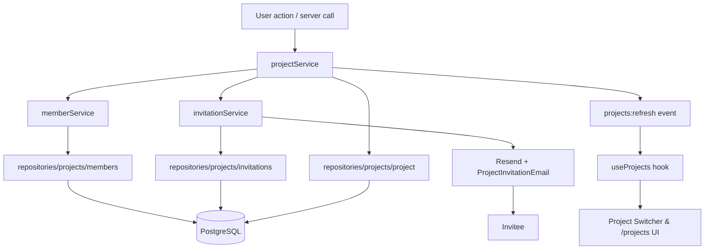

## Overview

The projects flow orchestrates project CRUD, membership lifecycles, invitations, and the project listing UI available at `/projects` and inside the dashboard sidebar/switcher. Business logic lives in service classes that rely on sanitized Kysely repositories with quoted aliases (per `@next-js.mdc`). React Server Components render server-fetched data while client helpers (`useProjects`, custom events) keep the project switcher, command palette, and cards synchronized.

**Main Libraries/Services:**

- **`services/projects/project-service.ts`** – Creates personal projects, validates permissions, updates names, and deletes projects.
- **`services/projects/member-service.ts`** – Provides role lookups and member CRUD helpers used by project and invitation logic.
- **`services/projects/invitation-service.ts`** – Issues invitations, sends transactional emails via Resend, and handles acceptance/cancellation.
- **`repositories/projects/*.ts`** – Kysely repositories (transactions, stats, invitations, members) with double-quoted camelCase aliases.
- **UI layer** – `app/(protected)/projects/page.tsx`, `components/dashboard/projects/*`, and the project switcher use data from the services.
- **`actions/delete-project.ts`** / `hooks/use-projects.ts` – Server action and client hook that manage deletion/refresh of project data through `projects:refresh` events.
- **React Email + Resend** – Deliver styled invitation emails with action buttons linking to `/accept-invitation?token=...`.

## File Map

- `services/projects/index.ts` – Exports `projectService`, `memberService`, `invitationService`.
- `services/projects/project-service.ts` – Core project lifecycle API, including `createPersonalProject` and `createProjectWithMembers`.
- `services/projects/member-service.ts` – Member helpers (`getUserRole`, `addMember`, `updateMemberRole`, etc.).
- `services/projects/invitation-service.ts` – Invitation creation, email delivery, acceptance, and cancellation.
- `repositories/projects/project.ts` – Project CRUD, enriched fetches (`findAllUserProjects`), and transactional creation with OWNER member.
- `repositories/projects/members.ts` – Member CRUD queries returning camelCase keys.
- `repositories/projects/invitations.ts` – Invitation persistence/query helpers with quoted aliases.
- `app/(protected)/projects/page.tsx` – Server component that fetches all user projects and renders `ProjectsOverview`.
- `components/dashboard/projects/*` – Presentational cards, list, overview, edit/delete buttons, skeletons, and “new project” modal.
- `components/dashboard/project/switcher/*` – Popover switcher tied to the same data set, listening to `projects:refresh`.
- `hooks/use-projects.ts` – Client hook that fetches `/api/projects`, caches client state, and dispatches refresh events after mutations.
- `actions/delete-project.ts` / `components/dashboard/projects/delete-button.tsx` – Server action + client dialog for project deletion.
- `emails/project-invitation-email.tsx` – Styled React email with visible CTA button; no raw URL exposed.
- `app/accept-invitation/page.tsx` – Accepts tokens, creates membership, and redirects to `/dashboard/{projectId}?invitation=accepted`.
- `components/dashboard/invitation-accepted-toast.tsx` – Toast shown after redirect; cleans URL parameter.

## Step-by-Step Flow

### Personal Project Creation (User Registration)

1. Registration flow calls `projectService.createPersonalProject(userId, userName)`.
2. Service builds a friendly project name (defaults to “My Project”).
3. `createProject` delegates to `createProjectWithOwner`, which:
   - Runs inside a Kysely transaction.
   - Inserts the project.
   - Inserts `project_members` row with OWNER role (role ID retrieved via `findRoleByName(PROJECT_ROLES.OWNER)`).
4. After the transaction, the service verifies the membership with `memberService.getUserRole`. If the OWNER role is missing, it self-heals by updating/creating the membership and throws on failure.
5. The new project ID becomes the default redirect for `/dashboard`.

### Project Creation with Optional Members

1. UI (`CreateProjectDialog`) or API routes call `projectService.createProject({ name, ownerId, members })`.
2. The service repeats the transactional OWNER logic, then iterates over optional members:
   - Existing users (`findUserByEmail`) → `memberService.addMember`.
   - Unknown emails → `invitationService.createInvitation` (which validates duplicates, creates token, sends email).
3. Returns the project plus the processed member payload so the UI can show a success summary.
4. Client components dispatch `projects:refresh` to sync switcher and lists.

### Listing & Navigation (`/projects` + Switcher)

1. `/projects/page.tsx` retrieves the session via `getCurrentUser()` and runs `projectService.getUserProjects(user.id)`.
2. Service loads owned + member projects (`findAllUserProjects`), then enriches each with:
   - Role (`memberService.getUserRole`).
   - Owner metadata (`findUserById`).
   - Member count (`memberService.getProjectMembers`).
3. The page renders `ProjectsOverview`, which:
   - Displays header + “New project” button (reuses project creation modal).
   - Delegates to `ProjectsList` to render responsive cards.
   - Shows an empty state with CTA when no projects exist.
4. `ProjectsList` iterates outside JSX, maps to `ProjectCard`, and exposes `EditProjectButton` (rename) and `DeleteProjectButton` (server action with confirmation). Both buttons trigger `projects:refresh`.
5. `hooks/use-projects.ts` listens to `projects:refresh`, refetches `/api/projects`, and updates state consumed by the switcher and command palette.

### Editing & Deleting Projects

1. `EditProjectButton` opens a dialog with a controlled form. Submission calls a server action (via `projectService.updateProject`) to update the name.
2. `projectService.updateProject` validates permissions with `memberService.getUserRole` and `canUpdateSettings`, updates the project name via `updateProject`, and reconciles member actions (if provided).
3. `DeleteProjectButton` triggers `actions/delete-project.ts`, which validates the current session, ensures OWNER permissions, calls `projectService.deleteProject`, and revalidates dashboard/project paths.
4. Successful edits/deletions emit `projects:refresh` so the switcher, `/projects`, and navigation update automatically.

### Invitation Lifecycle

1. `invitationService.createInvitation`:
   - Validates project, role, duplicate memberships/invitations.
   - Creates a UUID token with 7-day expiration.
   - Persists invitation via `createProjectInvitation`.
   - Renders `ProjectInvitationEmail` and sends through Resend.
2. Invite email button opens `/accept-invitation?token=...`.
3. `app/accept-invitation/page.tsx` validates token, expiration, and email match (`findUserById`), then:
   - Adds membership via `createProjectMember` if needed.
   - Deletes the invitation.
   - Redirects to `/dashboard/{projectId}?invitation=accepted` (forcing dynamic rendering).
4. Dashboard page renders `InvitationAcceptedToast`, which reads the query param, displays a Sonner success toast, and strips the param to avoid duplicates.
5. Cancellation uses `invitationService.cancelInvitation`, which ensures ADMIN-level access and deletes the token.

## Data Flow Diagram

## Dependencies & Contracts

- `projectService.createProject(data)` – Returns the created project plus member/invitation summary.
- `projectService.createPersonalProject(userId, userName)` – Guarantees OWNER membership; throws if self-healing fails.
- `projectService.getUserProjects(userId)` – Returns enriched projects for UI consumption.
- `projectService.updateProject(id, data, actorId)` – Enforces permissions, updates name, handles member actions.
- `projectService.deleteProject(id, actorId)` – Requires OWNER role and deletes via repository.
- `memberService` contracts – `getUserRole`, `addMember`, `updateMemberRole`, `removeMember`, `isProjectMember`.
- `invitationService` contracts – `createInvitation`, `acceptInvitation`, `cancelInvitation`, `getProjectInvitations`.
- `actions/delete-project.ts` – Server action signature `deleteProject({ projectId })`.
- `hooks/use-projects.ts` – Exposes `projects`, `isLoading`, `refresh`; dispatches `projects:refresh`.
- All repositories use Kysely parameter binding; camelCase aliases are wrapped in double quotes (e.g., `pm.project_id AS "projectId"`).

## Known Limitations

- Invitation expiration is fixed at 7 days; resend/extend flows are not implemented.
- Project ownership transfer is unsupported; deleting an owner removes the project entirely.
- Member operations in `updateProject` run sequentially and lack per-member transactional rollback.
- `memberService.hasPermission` remains deprecated; migrate to the dedicated permissions service for granular checks.
- `getUserProjects` can trigger multiple repository calls per project (role/members/owner). Consider batching if lists grow large.
- `useProjects` depends on client-side fetch; offline mode is not supported.

## Notes & TODOs

- ✅ Enforced double-quoted aliases and sanitized SQL in all project repositories.
- ✅ Introduced `/projects` static route, project cards, edit/delete dialogs, and switcher refresh events.
- ✅ Added invitation acceptance redirect + toast messaging and restyled email CTAs.
- 🔄 Add invitation resend/extend, plus explicit “pending invitations” management UI.
- 🔄 Implement project ownership transfer or shared ownership.
- 🔄 Persist activity/audit logs for membership changes and invitation actions.
- 🔄 Cache `getUserProjects` responses or expose a cursor-based API for large teams.
