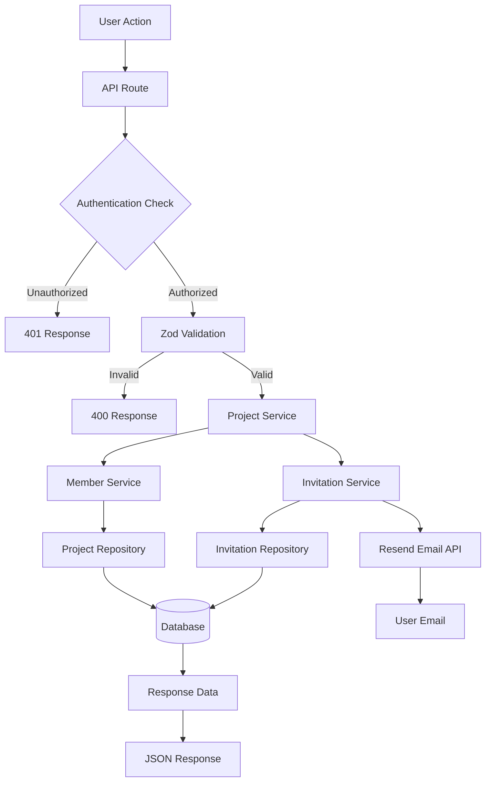
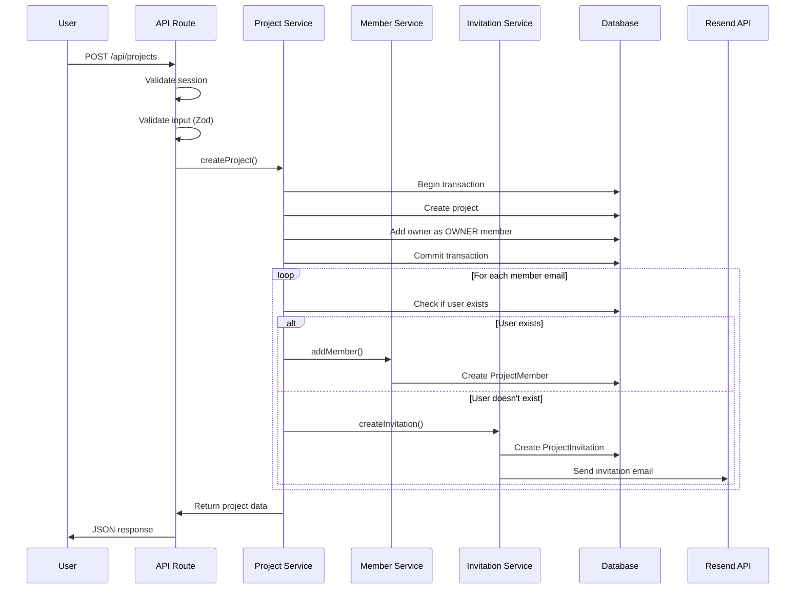
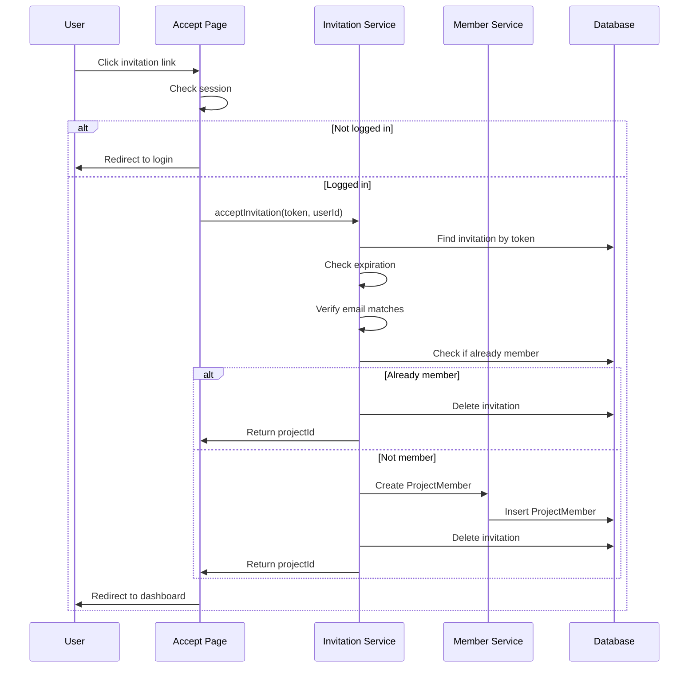

## Overview

This guide explains how project management works in the SaaS Starter application. The system enables users to create projects, invite team members, manage roles, and collaborate within a multi-tenant architecture. By the end of this guide, you'll understand:

- How projects are created and managed
- How members are added and removed from projects
- How invitation system works (email-based invitations)
- How role-based permissions control access
- The complete data flow from API requests to database operations

**Main Libraries/Services:**

- **Prisma** – Database ORM for managing projects, members, and invitations
- **NextAuth.js** – Session management for authentication
- **Resend** – Email service for sending invitation emails
- **Zod** – Schema validation for API requests
- **Next.js App Router** – API routes and server components

## File Map

### Services Layer (Business Logic)

```
services/projects/
├── index.ts – Main export file for all project services
├── project-service.ts – Project creation, updates, deletion logic
├── member-service.ts – Member management and permission checks
└── invitation-service.ts – Invitation creation, sending, and acceptance
```

### Repositories Layer (Data Access)

```
repositories/projects/
├── index.ts – Main export file for all project repositories
├── project.ts – Database operations for projects
├── members.ts – Database operations for project members
└── invitations.ts – Database operations for project invitations
```

### API Routes

```
app/api/projects/
├── route.ts – GET (list projects), POST (create project)
├── [id]/route.ts – GET (get project), PUT (update project), DELETE (delete project)
└── invite/route.ts – POST (send invitation)
```

### Frontend Pages

```
app/
└── accept-invitation/page.tsx – Page for accepting project invitations via token
```

### Database Models

```
prisma/schema.prisma
├── Project – Main project entity
├── ProjectMember – Links users to projects with roles
└── ProjectInvitation – Email invitations with tokens
```

## Step-by-Step Flow

### Project Creation Flow

1. **User Request**: Authenticated user sends POST request to `/api/projects` with project name and optional members
2. **Authentication Check**: API route validates session using `getServerSession()`
3. **Input Validation**: Zod schema validates request body (name, optional members array)
4. **Service Call**: `projectService.createProject()` is called with project data
5. **Database Transaction**:
   - Project is created in database
   - Owner is automatically added as OWNER member (atomic transaction)
6. **Member Processing**: For each provided member email:
   - If user exists → Added as member directly
   - If user doesn't exist → Invitation is created and email sent
7. **Response**: Project data with member information is returned

### Project Listing Flow

1. **User Request**: Authenticated user sends GET request to `/api/projects`
2. **Authentication Check**: Session is validated
3. **Service Call**: `projectService.getUserProjects()` fetches all projects user owns or is a member of
4. **Data Enrichment**: Each project is enriched with:
   - User's role in the project
   - Owner information
   - Member count
5. **Response**: Array of enriched project objects

### Project Update Flow

1. **User Request**: Authenticated user sends PUT request to `/api/projects/[id]` with updates
2. **Authentication Check**: Session is validated
3. **Permission Check**: `memberService.getUserRole()` verifies user is OWNER or ADMIN
4. **Input Validation**: Zod schema validates request body
5. **Service Call**: `projectService.updateProject()` processes updates:
   - Project name can be updated
   - Members can be added, updated (role change), or removed
6. **Member Action Processing**:
   - **Add**: If user exists → add as member; if not → send invitation
   - **Update**: Change existing member's role
   - **Remove**: Remove member and cancel any pending invitations
7. **Response**: Updated project data with member information

### Project Deletion Flow

1. **User Request**: Authenticated user sends DELETE request to `/api/projects/[id]`
2. **Authentication Check**: Session is validated
3. **Permission Check**: Service verifies user is OWNER and matches project ownerId
4. **Cascade Delete**: Project deletion cascades to:
   - All project members (via database constraints)
   - All pending invitations (via database constraints)
5. **Response**: Success confirmation

### Invitation Creation Flow

1. **User Request**: Authenticated user sends POST request to `/api/projects/invite` with projectId, email, and role
2. **Authentication Check**: Session is validated
3. **Permission Check**: Verifies user is OWNER or ADMIN of the project
4. **Input Validation**: Zod schema validates email and role
5. **Service Call**: `invitationService.createInvitation()`:
   - Validates project exists
   - Checks if user is already a member
   - Checks for existing pending invitations
   - Generates unique token (UUID)
   - Sets expiration date (7 days from now)
   - Creates invitation in database
6. **Email Sending**:
   - Renders invitation email template using React Email
   - Sends email via Resend API with accept URL
7. **Response**: Invitation data with expiration time

### Invitation Acceptance Flow

1. **User Click**: User clicks invitation link in email (`/accept-invitation?token=...`)
2. **Session Check**: Page checks if user is logged in
   - If not logged in → Redirects to login with callback URL
   - If logged in → Continues to acceptance
3. **Service Call**: `invitationService.acceptInvitation()`:
   - Validates token exists in database
   - Checks if invitation has expired
   - Verifies user's email matches invitation email
   - Checks if user is already a member (idempotent)
   - Creates ProjectMember record with specified role
   - Deletes invitation token
4. **Redirect**: User is redirected to project dashboard

### Member Management Flow

1. **Permission Checks**: `memberService.hasPermission()` uses role hierarchy:
   - OWNER (level 3) – Full access
   - ADMIN (level 2) – Can manage members
   - MEMBER (level 1) – Read-only access
2. **Role Retrieval**: `memberService.getUserRole()` gets user's role in project
3. **Member Operations**:
   - **Add**: Creates ProjectMember record
   - **Update Role**: Updates existing ProjectMember role
   - **Remove**: Deletes ProjectMember record

## Data Flow Diagram



### Project Creation Sequence



### Invitation Acceptance Sequence



## Dependencies & Contracts

### Main Types/Interfaces

- **`IProject`**: Represents a project entity

  ```typescript
  {
    id: string;
    name: string;
    ownerId: string;
    createdAt: Date;
    updatedAt: Date;
  }
  ```

- **`IProjectMember`**: Represents a project membership

  ```typescript
  {
    id: string;
    projectId: string;
    userId: string;
    role: ProjectRole;
    createdAt: Date;
    updatedAt: Date;
  }
  ```

- **`IProjectInvitation`**: Represents a pending invitation

  ```typescript
  {
    id: string;
    projectId: string;
    email: string;
    role: ProjectRole;
    invitedById: string;
    token: string;
    createdAt: Date;
    expiresAt: Date;
  }
  ```

- **`ProjectRole`**: Enum for project roles
  ```typescript
  enum ProjectRole {
    OWNER = "OWNER", // Full control, can delete project
    ADMIN = "ADMIN", // Can manage members and settings
    MEMBER = "MEMBER", // Standard access
  }
  ```

### Service Contracts

- **`ProjectService.createProject()`**: Creates project with owner as member atomically
- **`ProjectService.updateProject()`**: Updates project name and manages members (requires OWNER or ADMIN)
- **`ProjectService.deleteProject()`**: Deletes project (requires OWNER)
- **`MemberService.hasPermission()`**: Checks if user has required role level
- **`InvitationService.createInvitation()`**: Creates and sends invitation email
- **`InvitationService.acceptInvitation()`**: Accepts invitation and adds user as member

## Known Limitations

1. **Invitation Expiration**: Invitations expire after 7 days and cannot be extended
2. **Role Hierarchy**: Only OWNER and ADMIN can invite members; MEMBER cannot invite
3. **Email Matching**: Invitation acceptance requires exact email match (case-sensitive)
4. **No Bulk Operations**: Members must be added/updated one at a time
5. **No Invitation Resending**: Cannot resend expired invitations; must create new one
6. **No Project Transfer**: Cannot transfer project ownership to another user
7. **No Member Limits**: No built-in limit on number of members per project
8. **Cascade Deletes**: Deleting project removes all members and invitations (by design)

## Notes & TODOs

### Completed Features

- ✅ Project CRUD operations
- ✅ Member management with role-based permissions
- ✅ Email-based invitation system
- ✅ Automatic owner assignment on project creation
- ✅ Atomic transactions for data consistency
- ✅ Invitation expiration handling
- ✅ Email verification for invitation acceptance

### Future Improvements

- 🔄 Add project transfer ownership feature
- 🔄 Implement invitation resending functionality
- 🔄 Add bulk member operations
- 🔄 Create project templates
- 🔄 Add project-level settings and configurations
- 🔄 Implement project archiving (soft delete)
- 🔄 Add member activity tracking
- 🔄 Create project analytics dashboard
- 🔄 Add project member limits based on subscription tier
- 🔄 Implement project sharing via public links
- 🔄 Add project export functionality
- 🔄 Create project audit logs

### Technical Debt

- ⚠️ Error messages could be more user-friendly
- ⚠️ Add rate limiting for invitation creation
- ⚠️ Add email delivery status tracking
- ⚠️ Consider adding invitation cancellation API endpoint
- ⚠️ Add validation for duplicate member additions
- ⚠️ Improve error handling for email service failures

---

_This guide provides a complete understanding of how project management works in the SaaS Starter application. For questions or clarifications, refer to the service files or ask a senior developer._
