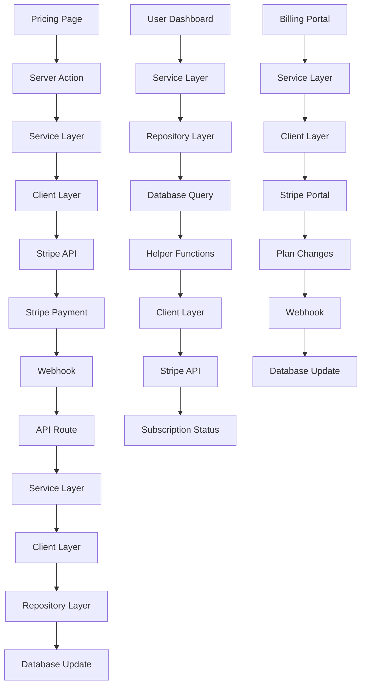

## Overview

Handles subscription management, payment processing, and billing operations using a modular architecture with Stripe. The system is organized into clear layers: types, repositories, clients, and services, providing better maintainability and testability. Supports multiple subscription tiers with monthly/yearly billing cycles and webhook-based subscription lifecycle management.

**Main libraries/services:**

- `stripe` - Payment processing and subscription management
- `@stripe/stripe-js` - Client-side Stripe integration
- Webhook endpoints for real-time subscription updates
- Prisma for subscription data persistence
- Modular architecture with separated concerns

## File Map

```
📁 types/subscriptions.ts - Centralized TypeScript interfaces
📁 lib/stripe.ts - Stripe client configuration
📁 config/subscriptions.ts - Pricing plans and tier definitions

📁 repositories/subscriptions/ - Data access layer
├── index.ts - Repository exports
├── find.ts - Database queries for subscriptions
├── create.ts - Subscription creation operations
├── update.ts - Subscription update operations
└── cancel.ts - Subscription cancellation operations

📁 clients/stripe/ - Stripe API integration layer
├── index.ts - Client exports
├── subscription.ts - Stripe subscription operations
└── invoices.ts - Stripe invoice operations

📁 services/subscriptions/ - Business logic layer
├── index.ts - Service exports
├── helpers.ts - Pure utility functions
├── get-plan.ts - Subscription plan retrieval
├── create.ts - Subscription creation logic
├── update.ts - Subscription update logic
├── cancel.ts - Subscription cancellation logic
└── webhooks.ts - Webhook event processing

📁 actions/generate-user-stripe.ts - Server action for checkout/billing portal
📁 app/api/webhooks/stripe/route.ts - Webhook endpoint (simplified)
📁 components/forms/billing-form-button.tsx - Billing UI components
📁 components/pricing/ - Pricing page components
📁 app/(protected)/dashboard/billing/page.tsx - Billing dashboard
📁 app/(marketing)/pricing/page.tsx - Public pricing page
```

## Step-by-Step Flow

### New Subscription Creation

1. User clicks "Upgrade" button on pricing page
2. `generateUserStripe` action is triggered with priceId
3. User authentication is verified via `auth()`
4. **Service Layer**: `getUserSubscriptionPlan` service fetches current subscription status
5. If user is on free plan:
   - **Client Layer**: `createCheckoutSession` creates Stripe checkout session
   - User metadata (userId) is attached to session
   - User is redirected to Stripe checkout
6. User completes payment on Stripe
7. Stripe webhook `checkout.session.completed` is triggered
8. **Webhook Processing**:
   - Webhook signature verified in API route
   - `handleWebhookEvent` service processes the event
   - `handleCheckoutCompleted` service handles the specific event
   - **Client Layer**: `retrieveSubscription` gets subscription details from Stripe
   - **Repository Layer**: `updateUserOnSubscriptionCreate` updates database

### Subscription Management (Existing Customers)

1. User clicks "Manage Billing" button
2. **Service Layer**: `getUserSubscriptionPlan` checks current subscription status
3. If user is on paid plan:
   - **Client Layer**: `createBillingPortalSession` creates Stripe portal session
   - User is redirected to Stripe customer portal
4. User can update payment methods, cancel, or change plans
5. Changes trigger webhook events for real-time updates

### Webhook Event Processing (Modular Architecture)

1. Stripe sends webhook to `/api/webhooks/stripe`
2. **API Route**: Webhook signature is verified using `STRIPE_WEBHOOK_SECRET`
3. **Service Layer**: `handleWebhookEvent` service processes the event
4. Event routing based on type:
   - `checkout.session.completed`: Calls `handleCheckoutCompleted` service
   - `invoice.payment_succeeded`: Calls `handlePaymentSucceeded` service
5. **Service Layer**: Business logic validation and orchestration
6. **Client Layer**: Stripe API calls for data retrieval
7. **Repository Layer**: Database operations for data persistence
8. **Response**: Success/error response sent back to Stripe

### Subscription Plan Detection (Service Layer)

1. **Service Layer**: `getUserSubscriptionPlan` orchestrates the process
2. **Repository Layer**: `findUserSubscription` fetches user data from database
3. **Helper Functions**: `isSubscriptionActive` checks plan validity
4. **Helper Functions**: `findPlanByPriceId` matches pricing data
5. **Helper Functions**: `determinePlanInterval` determines billing cycle
6. **Client Layer**: `retrieveSubscription` gets cancellation status from Stripe
7. **Helper Functions**: `formatSubscriptionPlan` formats final response
8. UI components use this data for conditional rendering

## Data Flow Diagram



## Architecture Layers

### Types Layer

- **Purpose**: Centralized TypeScript interfaces
- **Files**: `types/subscriptions.ts`
- **Responsibilities**: Type definitions, interfaces, data contracts

### Repository Layer

- **Purpose**: Data access and persistence
- **Files**: `repositories/subscriptions/*`
- **Responsibilities**: Database queries, data transformation, error handling

### Client Layer

- **Purpose**: External API integration
- **Files**: `clients/stripe/*`
- **Responsibilities**: Stripe API calls, request/response handling

### Service Layer

- **Purpose**: Business logic and orchestration
- **Files**: `services/subscriptions/*`
- **Responsibilities**: Business rules, validation, coordination between layers

## Subscription Tiers

- **Starter**: Free tier (no Stripe integration)
- **Pro**: $15/month or $144/year
- **Business**: $30/month or $300/year

## Dependencies & Contracts

### Core Types

- `SubscriptionData`: Core subscription information from Stripe
- `UserSubscriptionRecord`: Database representation of user subscription
- `SubscriptionServiceResponse`: Standardized service response format
- `CheckoutSessionData`: Data required for creating checkout sessions
- `UpdateSubscriptionData`: Data for subscription updates

### Service Contracts

- `getUserSubscriptionPlan(userId: string)`: Retrieves formatted subscription plan
- `createSubscription(userId: string, priceId: string)`: Creates new subscription
- `updateSubscription(subscriptionId: string, priceId: string)`: Updates existing subscription
- `cancelSubscription(subscriptionId: string)`: Cancels subscription
- `handleWebhookEvent(event: Stripe.Event)`: Processes webhook events

### Repository Contracts

- `findUserSubscription(userId: string)`: Finds user subscription data
- `createUserSubscription(data: CreateSubscriptionData)`: Creates subscription record
- `updateUserSubscription(userId: string, data: UpdateSubscriptionData)`: Updates subscription
- `cancelUserSubscription(userId: string)`: Marks subscription as canceled

### Client Contracts

- `createCheckoutSession(data: CheckoutSessionData)`: Creates Stripe checkout session
- `createBillingPortalSession(customerId: string, returnUrl: string)`: Creates billing portal
- `retrieveSubscription(subscriptionId: string)`: Gets subscription from Stripe
- `updateSubscription(subscriptionId: string, data: UpdateSubscriptionData)`: Updates in Stripe

## Known Limitations

- Webhook events are processed synchronously (no retry mechanism)
- No support for subscription proration when changing plans
- Limited error handling for Stripe API failures
- No subscription analytics or reporting
- Single currency support (USD only)
- No support for usage-based billing

## Notes and TODOs

### ✅ Completed Features

- ✅ Modular architecture with separated concerns
- ✅ Checkout session creation for new subscriptions
- ✅ Billing portal integration for existing customers
- ✅ Webhook handling for subscription lifecycle events
- ✅ Multi-tier pricing with monthly/yearly options
- ✅ Subscription status detection and plan matching
- ✅ Type-safe interfaces throughout the system
- ✅ Pure utility functions for business logic
- ✅ Centralized error handling patterns

### 🔄 In Progress

- 🔄 Add comprehensive error handling and retry mechanisms
- 🔄 Implement subscription analytics and reporting
- 🔄 Add support for multiple currencies

### 📋 Future Enhancements

- 📋 Add support for proration when changing plans
- 📋 Implement subscription cancellation grace periods
- 📋 Add usage-based billing for higher tiers
- 📋 Consider adding trial periods for new users
- 📋 Add subscription metrics and monitoring
- 📋 Implement subscription pause/resume functionality
- 📋 Add support for subscription add-ons and upgrades
