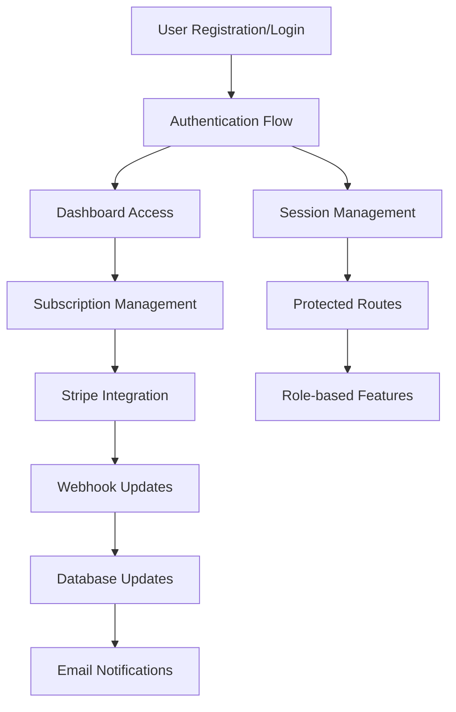

# SaaS Starter Kit - Core Flows Documentation

## 📋 Overview

This directory contains comprehensive documentation for all core flows in the SaaS Starter Kit. Each flow is documented with step-by-step processes, file mappings, data flow diagrams, and implementation notes.

## 📁 Documentation Files

### 🔐 [Authentication Flow](./auth.md)

**Purpose**: User authentication and session management  
**Key Features**:

- Google OAuth integration
- Email magic link authentication
- Role-based access control (USER/ADMIN)
- JWT session strategy
- Protected route middleware

**Main Technologies**: NextAuth v5, PrismaAdapter, Resend

### 💳 [Stripe Integration Flow](./stripe.md)

**Purpose**: Subscription management and payment processing  
**Key Features**:

- Multi-tier subscription plans (Starter/Pro/Business)
- Monthly and yearly billing cycles
- Stripe checkout and billing portal integration
- Webhook-based subscription lifecycle management
- Real-time subscription status updates

**Main Technologies**: Stripe API, Webhooks, Prisma

### 📧 [Email Handling Flow](./emails.md)

**Purpose**: Email delivery and communication  
**Key Features**:

- Magic link authentication emails
- React Email templates with Tailwind styling
- Development/production email routing
- Custom email headers for deliverability
- Resend service integration

**Main Technologies**: Resend, React Email, NextAuth

### 🗄️ [Database Flow](./database.md)

**Purpose**: Data persistence and management  
**Key Features**:

- PostgreSQL with Prisma ORM
- User authentication data
- Subscription and billing data
- OAuth account linking
- Session management

**Main Technologies**: Prisma, PostgreSQL (Neon), NextAuth PrismaAdapter

### 🎛️ [Dashboard Flow](./dashboard.md)

**Purpose**: Protected user interface and management  
**Key Features**:

- Role-based dashboard access
- Billing management interface
- User settings and profile management
- Admin panel with system controls
- Chart examples and data visualization

**Main Technologies**: Next.js App Router, Server Components, Role-based Access Control

## 🔄 Flow Interactions

## 🏗️ Architecture Summary

### Frontend

- **Next.js 14** with App Router
- **React Server Components** for performance
- **Tailwind CSS** for styling
- **shadcn/ui** component library

### Backend

- **NextAuth v5** for authentication
- **Prisma ORM** for database operations
- **Stripe** for payment processing
- **Resend** for email delivery

### Database

- **PostgreSQL** (hosted on Neon)
- **Prisma migrations** for schema management
- **NextAuth PrismaAdapter** for auth integration

### External Services

- **Google OAuth** for social authentication
- **Stripe** for payments and subscriptions
- **Resend** for email delivery
- **Neon** for database hosting

## 🚀 Getting Started

1. **Environment Setup**: Configure all required environment variables
2. **Database**: Run Prisma migrations to set up the database
3. **Authentication**: Set up Google OAuth and Resend credentials
4. **Stripe**: Configure Stripe products, prices, and webhooks
5. **Development**: Start the development server and test all flows

## 📝 Implementation Status

### ✅ Completed Features

- User authentication (OAuth + Magic Links)
- Subscription management with Stripe
- Email delivery with custom templates
- Role-based access control
- Protected dashboard interface
- Admin panel functionality
- Database schema and operations

### 🔄 Areas for Enhancement

- Content creation features in dashboard
- Advanced admin user management
- Email templates for notifications
- Usage-based billing options
- Analytics and reporting features
- User onboarding flow

## 🔧 Configuration Requirements

### Environment Variables

- `DATABASE_URL` - PostgreSQL connection string
- `GOOGLE_CLIENT_ID` & `GOOGLE_CLIENT_SECRET` - OAuth credentials
- `RESEND_API_KEY` - Email service API key
- `STRIPE_API_KEY` & `STRIPE_WEBHOOK_SECRET` - Payment processing
- `NEXTAUTH_SECRET` - Session encryption

### External Service Setup

- **Google OAuth**: Create OAuth 2.0 credentials
- **Stripe**: Set up products, prices, and webhook endpoints
- **Resend**: Create API key and verify domain
- **Neon**: Create PostgreSQL database instance

## 📚 Additional Resources

- [NextAuth Documentation](https://authjs.dev/)
- [Stripe Integration Guide](https://stripe.com/docs)
- [Prisma Documentation](https://www.prisma.io/docs)
- [Resend Email Service](https://resend.com/docs)
- [Next.js App Router](https://nextjs.org/docs/app)

---

_This documentation was generated by analyzing the SaaS Starter Kit codebase and mapping all core flows for developer reference._
